# 🏥 Chatbot Rasa Médical - Analyse des Données d'AVC

> **Chatbot multilingue intelligent spécialisé dans l'analyse et la visualisation de données cliniques sur les accidents vasculaires cérébraux (AVC)**

## 📋 Table des Matières

- [🎯 Vue d'ensemble](#-vue-densemble)
- [🏗️ Architecture du Projet](#️-architecture-du-projet)
- [🧠 Pipeline de Traitement NLU](#-pipeline-de-traitement-nlu)
- [🌍 Support Multilingue](#-support-multilingue)
- [📊 Entités Métier Supportées](#-entités-métier-supportées)
- [⚙️ Installation et Configuration](#️-installation-et-configuration)
- [🚀 Démarrage Rapide](#-démarrage-rapide)
- [🧪 Exécution de l'Environnement de Test](#-exécution-de-lenvironnement-de-test)
- [🔧 Guide de Développement](#-guide-de-développement)
- [📁 Structure Détaillée](#-structure-détaillée)
- [🎯 Cas d'Usage](#-cas-dusage)
- [🔍 Debugging et Monitoring](#-debugging-et-monitoring)
- [🤝 Contribution](#-contribution)

---

## 🎯 Vue d'ensemble

Ce projet est un **chatbot conversationnel avancé** développé avec Rasa, spécialement conçu pour interagir avec des professionnels de santé dans le domaine de l'analyse des AVC. Il permet de :

### ✨ Fonctionnalités principales

- 📈 **Génération de visualisations** de données cliniques en langage naturel
- 🌐 **Support multilingue** (Français, Anglais, Danois, Allemand, Espagnol, etc.)
- 🏷️ **Extraction intelligente d'entités** médicales (KPI, types d'AVC, données démographiques)
- 📊 **Analyse de données complexes** avec filtres temporels, démographiques et cliniques
- 🎯 **Réponses contextuelles** adaptées au domaine médical

### 💡 Exemple d'interaction

```
👨‍⚕️ Utilisateur: "Montrez-moi les temps DTN pour les patients masculins de plus de 65 ans"
🤖 Chatbot: [Génère un graphique avec les données Door-to-Needle pour hommes >65 ans]

👨‍⚕️ Utilisateur: "Vis mig NIHSS data for kvindelige strokepatienter" (Danois)
🤖 Chatbot: [Analyse et affiche les données NIHSS pour patientes féminines]
```

---

## 🏗️ Architecture du Projet

### 📐 Architecture en Couches (Layer-based)

Le projet utilise une **architecture innovante en couches** qui permet une gestion élégante du multilinguisme :

```
📁 src/
├── 🔧 core/           # Configuration de base et données communes
├── 🌍 locales/        # Adaptations par langue/région
└── 📚 shared/SSOT/    # Single Source of Truth - Définitions partagées
```

#### 🔄 Flux de fusion des couches

1. **Base (Core)** : Configuration générale + données de base
2. **Locale spécifique** : Traductions et adaptations culturelles
3. **Fusion automatique** : Le système combine intelligemment les couches

### 🏭 Composants Personnalisés

- **`LayeredImporter`** : Fusionne les données des différentes couches
- **`EntityConsolidator`** : Consolide les entités extraites par plusieurs extracteurs
- **Scripts de construction** : Automatisation du déploiement multilingue

---

## 🧠 Pipeline de Traitement NLU

### 🔄 Flux de traitement d'une requête utilisateur

```mermaid
graph LR
    A[👤 Utilisateur] --> B[📝 WhitespaceTokenizer]
    B --> C[🎭 RegexFeaturizer]
    C --> D[📊 LexicalSyntacticFeaturizer]
    D --> E[🔢 CountVectorsFeaturizer]
    E --> F[🧠 DIETClassifier]
    F --> G[🏷️ RegexEntityExtractor]
    G --> H[🔄 EntitySynonymMapper]
    H --> I[🎯 ResponseSelector]
    I --> J[🔧 EntityConsolidator]
    J --> K[⚡ Action]
```



### 🧠 DIETClassifier - Cœur du système

**DIETClassifier** (Dual Intent and Entity Transformer) est le composant central qui :

#### 🎯 Classification d'intentions
- **`generate_visualization`** : Génération de graphiques/analyses
- **`greet`** / **`goodbye`** : Salutations
- **`issue_command`** : Commandes système
- **`fallback`** : Gestion des requêtes non comprises

#### 🏷️ Extraction d'entités médicales
- **KPI** : Indicateurs de performance (DTN, DIDO, NIHSS, etc.)
- **Filtres démographiques** : Âge, sexe
- **Types d'AVC** : Ischémique, hémorragique, TIA, etc.
- **Filtres temporels** : Dates avec rôles (début/fin)
- **Types de graphiques** : Ligne, barres, histogramme, etc.

### ⚙️ Configuration actuelle

```yaml
DIETClassifier:
  epochs: 100                    # Entraînement intensif
  constrain_similarities: true   # Améliore la distinction
  model_confidence: softmax      # Calcul de confiance
  entity_recognition: true       # Extraction d'entités active
```

---

## 🌍 Support Multilingue

### 🗺️ Langues et régions supportées

| Langue | Régions | État | Exemples d'usage |
|--------|---------|------|------------------|
| 🇺🇸 **Anglais** | US, GB | ✅ Complet | "Show me NIHSS data for male patients" |
| 🇫🇷 **Français** | FR | ✅ Complet | "Montrez-moi les données DTN" |
| 🇩🇰 **Danois** | DK | ✅ Complet | "Vis mig DIDO for mandlige patienter" |
| 🇩🇪 **Allemand** | DE | 🚧 En cours | "Zeigen Sie mir Schlaganfall-Daten" |
| 🇪🇸 **Espagnol** | ES, MX, US, 419 | 🚧 En cours | "Muéstrame datos de ictus" |
| 🇨🇳 **Chinois** | Hans, Hant | 🚧 En cours | "显示中风数据" |
| 🇨🇿 **Tchèque** | CZ | 🚧 En cours | "Zobrazit data o mrtvici" |
| 🇬🇷 **Grec** | GR | 🚧 En cours | "Δείξε μου δεδομένα εγκεφαλικού" |

### 🔄 Mécanisme de fallback

```
Requête → Locale spécifique → Locale langue → Anglais US (fallback)
```

---

## 📊 Entités Métier Supportées

### 🏥 KPI Médicaux (Indicateurs de Performance)

| KPI | Description | Exemple d'usage |
|-----|-------------|-----------------|
| **DTN** | Door-to-Needle Time | "Temps DTN < 60 minutes" |
| **DIDO** | Door-in-Door-out Time | "DIDO pour transferts" |
| **NIHSS** | Score neurologique | "NIHSS admission vs sortie" |
| **LOS** | Length of Stay | "Durée d'hospitalisation" |
| **mRS** | Modified Rankin Scale | "Résultats fonctionnels" |

### 🧬 Types d'AVC

```yaml
Types supportés:
- ISCHEMIC (Ischémique)
- INTRACEREBRAL_HEMORRHAGE (Hémorragie intracérébrale)
- TRANSIENT_ISCHEMIC (AIT - Accident Ischémique Transitoire)
- SUBARACHNOID_HEMORRHAGE (Hémorragie sous-arachnoïdienne)
- CEREBRAL_VENOUS_THROMBOSIS (Thrombose veineuse cérébrale)
- STROKE_MIMICS (Imitations d'AVC)
- UNDETERMINED (Type indéterminé)
```

### 📈 Types de Visualisations

- **LINE** : Graphiques linéaires / Séries temporelles
- **BAR** : Graphiques en barres / Colonnes
- **BOX** : Boîtes à moustaches
- **HISTOGRAM** : Histogrammes / Distributions
- **SCATTER** : Nuages de points

### 👥 Filtres Démographiques

- **Sexe** : Masculin, Féminin, Tous
- **Âge** : Avec rôles (borne inférieure/supérieure)
- **Groupements** : Service, type de contact initial, etc.

---

## ⚙️ Installation et Configuration

### 📋 Prérequis

```bash
# Versions requises
Python >= 3.8
Rasa >= 3.6.21
Docker (optionnel)
```

### 🔧 Installation locale

```bash
# 1. Cloner le projet
git clone <repository-url>
cd Rasa

# 2. Installer les dépendances
pip install -r requirements.txt

# 3. Installer Rasa
pip install rasa[full]==3.6.21

# 4. Vérifier l'installation
python -c "import src.components.layered_importer; print('✅ Composants OK')"
```

### 🐳 Installation Docker

```bash
# Construction avec Docker
docker build -t rasa-medical-chatbot .

# Lancement
docker run -p 5005:5005 rasa-medical-chatbot
```

---

## 🚀 Démarrage Rapide

### 🏋️ Entraînement du modèle

```bash
# Entraînement pour une langue spécifique
./scripts/layer_rasa_lang.sh fr/FR

# Entraînement multilingue
./scripts/layer_rasa_projects.sh "src/core src/locales/fr/FR src/locales/en/US"

# Entraînement avec debug
rasa train --debug --config src/core/config.yml
```

### 🎯 Test interactif

```bash
# Mode shell interactif
rasa shell --debug

# Test avec exemples
rasa shell --endpoints src/core/endpoints.yml
```

### 🌐 Démarrage serveur

```bash
# Serveur API
rasa run --enable-api --cors "*"

# Serveur avec endpoints personnalisés
rasa run --endpoints src/core/endpoints.yml
```

---

## 🧪 Exécution de l'Environnement de Test

### 🎯 Guide Rapide

Votre projet dispose d'un **script interactif** pour vous guider :

```bash
# Lancer le guide interactif
chmod +x run_test_environment.sh
./run_test_environment.sh
```

### 🐳 **Méthode 1 : Docker (Recommandée)**

La méthode la plus simple et reproductible :

```bash
# Construction avec langue spécifique
docker build --build-arg LAYERS="src/core src/locales/fr/FR" -t rasa-medical-fr .

# Lancement du serveur
docker run -p 5005:5005 rasa-medical-fr

# Mode interactif pour tests
docker run -it rasa-medical-fr rasa shell

# Mode développement (avec synchronisation des fichiers)
docker run -v $(pwd)/src:/app/src -p 5005:5005 rasa-medical-fr
```

**🎯 Avantages Docker :**
- ✅ Environnement isolé et reproductible
- ✅ Toutes les dépendances incluses automatiquement
- ✅ Support multilingue intégré
- ✅ Pas de conflits avec votre système

### 💻 **Méthode 2 : Exécution Locale**

Pour le développement et le debugging :

```bash
# 1. Installation des dépendances
pip install -r requirements.txt
pip install rasa[full]==3.6.21

# 2. Configuration de l'environnement
export PYTHONPATH=$(pwd):$(pwd)/src

# 3. Construction du modèle
./scripts/layer_rasa_lang.sh fr/FR

# 4. Test interactif
rasa shell --debug

# 5. Serveur API
rasa run --enable-api --cors "*"
```

**🎯 Avantages Local :**
- ✅ Développement plus rapide
- ✅ Debug complet avec accès aux logs
- ✅ Modification en temps réel
- ✅ Contrôle total de l'environnement

### 🔧 **Méthode 3 : Scripts Automatiques**

Utilisation des scripts de construction intégrés :

```bash
# Construction par langue
./scripts/layer_rasa_lang.sh da/DK    # Danois
./scripts/layer_rasa_lang.sh fr/FR    # Français
./scripts/layer_rasa_lang.sh en/US    # Anglais

# Construction multi-langues
./scripts/layer_rasa_projects.sh "src/core src/locales/fr/FR src/locales/en/US"

# Mode dry-run (test sans entraînement)
./scripts/layer_rasa_lang.sh --dry-run fr/FR

# Debug avec dump des données
./scripts/layer_rasa_lang.sh --dump-dir ./debug fr/FR
```

### 🧪 **Tests et Validation**

Une fois l'environnement lancé :

```bash
# Test API REST
curl -X POST http://localhost:5005/webhooks/rest/webhook \
     -H "Content-Type: application/json" \
     -d '{"sender": "test", "message": "Montrez-moi les données DTN"}'

# Test des composants personnalisés
python analyze_diet_classifier.py

# Validation croisée NLU
rasa test nlu --config src/core/config.yml --cross-validation
```

### 🌍 **Tests Multilingues**

Exemples de requêtes à tester dans chaque langue :

| Langue | Exemple de requête | Résultat attendu |
|--------|-------------------|------------------|
| 🇫🇷 Français | "Montrez-moi les temps DTN" | Extraction: kpi=DTN |
| 🇩🇰 Danois | "Vis mig NIHSS data for mænd" | Extraction: kpi=NIHSS, sex=male |
| 🇺🇸 Anglais | "Show stroke data for women" | Extraction: kpi=stroke_data, sex=female |

### 🚨 **Troubleshooting Courant**

| Problème | Solution |
|----------|----------|
| `layered_importer module not found` | `export PYTHONPATH=$(pwd):$(pwd)/src` |
| `Permission denied sur scripts` | `chmod +x scripts/*.sh` |
| `Port 5005 already in use` | `docker ps \| grep 5005` puis `docker stop <container>` |
| `Docker build failed` | Vérifiez que Docker Desktop est lancé |

---

## 🔧 Guide de Développement

### 🎯 Ajout d'une nouvelle intention

1. **Définir l'intention** dans `src/core/domain/intents/`
2. **Ajouter des exemples** dans `src/core/data/nlu/intent/`
3. **Créer la règle** dans `src/core/data/rules/`
4. **Implémenter l'action** (si nécessaire)
5. **Traduire** dans les locales spécifiques

### 🌍 Ajout d'une nouvelle langue

```bash
# 1. Créer la structure
mkdir -p src/locales/[code_langue]/[REGION]/{data/nlu,domain/responses}

# 2. Traduire les fichiers de base
cp -r src/locales/en/US/* src/locales/[code_langue]/[REGION]/

# 3. Adapter les traductions
# Modifier les fichiers .yml avec les traductions

# 4. Tester
./scripts/layer_rasa_lang.sh [code_langue]/[REGION]
```

### 🏷️ Ajout d'entités métier

1. **Définir dans SSOT** : `src/shared/SSOT/[entity_type].yml`
2. **Ajouter au domaine** : `src/core/domain/entities/`
3. **Configurer les synonymes** : EntitySynonymMapper
4. **Ajouter des exemples** dans les données NLU

### 🔧 Modification du pipeline

```yaml
# Exemple : Ajouter un composant custom
pipeline:
  # ...composants existants...
  - name: your.custom.component.MyComponent
    parameter1: value1
    parameter2: value2
```

---

## 📁 Structure Détaillée

```
📁 Rasa/
├── 📄 README.md                    # Ce fichier
├── 📄 requirements.txt             # Dépendances Python
├── 📄 Dockerfile                   # Image Docker
├── 📄 LICENSE                      # Licence du projet
│
├── 📁 scripts/                     # Scripts de construction
│   ├── 🔧 layer_rasa_lang.sh      # Construction par langue
│   ├── 🔧 layer_rasa_projects.sh  # Construction multi-projets
│   └── 🐍 list_languages.py       # Lister les langues disponibles
│
├── 📁 src/
│   ├── 📁 components/              # Composants personnalisés
│   │   ├── 🐍 layered_importer.py # Fusion des couches
│   │   └── 🐍 entity_consolidator.py # Consolidation d'entités
│   │
│   ├── 📁 core/                    # Configuration de base
│   │   ├── ⚙️ config.yml          # Pipeline principal
│   │   ├── 🔌 endpoints.yml       # Configuration API
│   │   ├── 🔐 credentials.yml     # Identifiants
│   │   │
│   │   ├── 📁 data/               # Données d'entraînement de base
│   │   │   ├── 📁 nlu/intent/     # Exemples d'intentions
│   │   │   └── 📁 rules/          # Règles conversationnelles
│   │   │
│   │   └── 📁 domain/             # Définition du domaine
│   │       ├── 📁 intents/        # Liste des intentions
│   │       ├── 📁 entities/       # Définition des entités
│   │       ├── 📁 actions/        # Actions disponibles
│   │       └── 📁 responses/      # Templates de réponses
│   │
│   ├── 📁 locales/                # Adaptations linguistiques
│   │   ├── 📁 fr/FR/              # Français (France)
│   │   ├── 📁 en/US/              # Anglais (États-Unis)
│   │   ├── 📁 da/DK/              # Danois (Danemark)
│   │   ├── 📁 de/DE/              # Allemand (Allemagne)
│   │   └── 📁 [autres langues]/   # Autres localisations
│   │
│   └── 📁 shared/SSOT/            # Single Source of Truth
│       ├── 📄 kpi.yml             # Définitions des KPI
│       ├── 📄 strokeTypes.yml     # Types d'AVC
│       ├── 📄 chartTypes.yml      # Types de graphiques
│       ├── 📄 sexTypes.yml        # Types de genre
│       ├── 📄 groupBy.yml         # Critères de regroupement
│       └── 📄 booleanTypes.yml    # Valeurs booléennes
│
└── 📁 models/                     # Modèles entraînés (généré)
```

---

## 🎯 Cas d'Usage

### 👩‍⚕️ Scénarios Médicaux Typiques

#### 1. **Analyse de Performance Clinique**
```
👨‍⚕️ "Montrez-moi les temps door-to-needle pour les patients masculins ce mois-ci"
🤖 Extrait: intention=generate_visualization, kpi=DTN, sex=male, date=current_month
🤖 Action: Génère graphique temporel des temps DTN filtrés
```

#### 2. **Comparaison Démographique**
```
👨‍⚕️ "Comparez le NIHSS d'admission entre hommes et femmes de plus de 70 ans"
🤖 Extrait: kpi=NIHSS, sex=[male,female], age_lower=70, chart_type=comparison
🤖 Action: Graphique comparatif par genre avec filtre d'âge
```

#### 3. **Analyse par Type d'AVC**
```
👨‍⚕️ "Durée d'hospitalisation moyenne pour AVC ischémiques vs hémorragiques"
🤖 Extrait: kpi=LOS, stroke_type=[ischemic,hemorrhagic], group_by=stroke_type
🤖 Action: Analyse comparative des durées de séjour
```

### 🌍 Exemples Multilingues

#### 🇩🇰 Danois
```
"Vis mig DTN for mandlige patienter mellem 50 og 80 år"
→ KPI: DTN, Sexe: masculin, Âge: 50-80 ans
```

#### 🇫🇷 Français
```
"Créez un histogramme des âges pour les patientes avec AVC ischémique"
→ Graphique: histogramme, Variable: âge, Filtre: femmes + ischémique
```

#### 🇺🇸 Anglais
```
"Show NIHSS improvement from admission to discharge for stroke patients"
→ KPI: NIHSS, Rôles: admission/discharge, Type: amélioration
```

---

## 🔍 Debugging et Monitoring

### 📊 Activation du Debug

```yaml
# Dans config.yml
pipeline:
  - name: src.components.entity_consolidator.EntityConsolidator
    debug_logging: true        # Active les logs détaillés
    collect_stats: true        # Collecte des statistiques
```

### 🔍 Commandes de Debug

```bash
# Mode debug complet
rasa shell --debug

# Évaluation croisée
rasa test nlu --cross-validation --config src/core/config.yml

# Test de performance
rasa test nlu --nlu src/core/data/nlu/ --config src/core/config.yml

# Analyse des métriques
rasa test nlu --config src/core/config.yml --successes
```

### 📈 Métriques importantes

- **Confiance d'intention** : >0.7 recommandé
- **F1-score des entités** : >0.85 pour les entités critiques
- **Précision du pipeline** : Monitoring via EntityConsolidator
- **Temps de réponse** : <500ms pour requêtes standard

### 🚨 Debugging Courant

#### Problème : Intention mal classifiée
```bash
# Solution 1: Ajouter plus d'exemples
# Solution 2: Ajuster les paramètres DIETClassifier
# Solution 3: Vérifier les données d'entraînement
```

#### Problème : Entités non extraites
```bash
# Vérification : regex dans RegexEntityExtractor
# Solution : Ajouter synonymes dans SSOT
# Debug : Activer debug_logging dans EntityConsolidator
```

---

## 🤝 Contribution

### 🎯 Comment Contribuer

1. **Nouvelles Langues** : Suivre le guide d'ajout de langue
2. **Entités Médicales** : Ajouter dans `src/shared/SSOT/`
3. **Améliorations Pipeline** : Modifier `config.yml` avec tests
4. **Cas d'Usage** : Documenter nouveaux scénarios médicaux

### 📝 Standards de Code

- **Python** : PEP 8, type hints, docstrings
- **YAML** : Indentation 2 espaces, structure cohérente
- **Tests** : Validation obligatoire avant PR
- **Documentation** : Mise à jour README pour nouvelles fonctionnalités

### 🚀 Roadmap

- [ ] **Extension entités** : Médicaments, dosages, protocoles
- [ ] **Visualisations avancées** : Cartes de chaleur, graphiques 3D
- [ ] **Intégration FHIR** : Connexion standards médicaux
- [ ] **Intelligence augmentée** : Suggestions proactives
- [ ] **Analytics temps réel** : Monitoring performance clinique

---

## 📞 Support et Contact

### 🆘 Besoin d'aide ?

- **Issues** : Utiliser le système d'issues GitHub
- **Documentation** : Ce README + commentaires dans le code
- **Tests** : Scripts de test inclus dans le projet

### 📚 Ressources Utiles

- [Documentation Rasa](https://rasa.com/docs/)
- [Guide DIETClassifier](https://rasa.com/docs/rasa/components#dietclassifier)
- [Multilingual Chatbots](https://rasa.com/docs/rasa/how-to-build-multilingual-assistants)

---

**🏥 Projet développé pour l'amélioration des soins en neurologie et l'analyse des données d'AVC**

*Dernière mise à jour : 2025-01-30*
